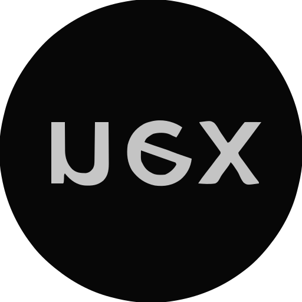

<div align="center">



A keyboard-first launcher for Windows. Press a global hotkey to summon a floating search bar and quickly find and launch applications, files, folders, and custom actions.

[](#)
[](LICENSE)
[](https://github.com/haxllo/nex)


</div>

## Installation

### Binary Release (Recommended)

Download the latest release for your platform from the
[Releases page](https://github.com/haxllo/nex/releases/latest).

After downloading, run the installer and follow the setup instructions.

---

### Build from Source

```bash
git clone https://github.com/haxllo/nex.git
cd nex
cargo build --release
```

Binary location:

```text
target/release/nex
```

## Overview

Nex is a lightweight, fast launcher that puts your workflow at your fingertips. Built in Rust for minimal memory footprint and near-instant responsiveness.

### Key Features

- **Global Hotkey** - Summon the launcher from anywhere with a customizable keyboard shortcut
- **Fuzzy Search** - Find apps, files, and folders with intelligent matching via Tantivy full-text search
- **Everything SDK** - Optional integration with Voidtools Everything for instant file search
- **Actions** - Execute custom commands, web searches, and system operations
- **Calculator** - Inline arithmetic evaluation directly in the search bar
- **Clipboard History** - Access recently copied items (optional)
- **Plugins** - Extend functionality with a custom plugin SDK
- **Auto-Updater** - Keep Nex up to date with built-in update checks
- **File Watching** - Real-time index updates when files change on disk
- **Game Mode** - Suppress the launcher while gaming

## Quick Start

### Run

```bash
cargo run --release
```

Or run the built binary directly:

```bash
./target/release/nex.exe
```

### Configuration

On first launch, Nex creates a default config at:
```
%APPDATA%\Nex\config.toml
```

Key settings:

| Setting | Default | Description |
|---------|---------|-------------|
| `hotkey` | `Alt+Space` | Global hotkey to summon launcher |
| `max_results` | `8` | Maximum results to display |
| `show_files` | `false` | Include files in search |
| `show_folders` | `false` | Include folders in search |
| `launch_at_startup` | `false` | Start with Windows |

### CLI Commands

```bash
nex --status          # Check if running
nex --quit            # Stop the launcher
nex --restart         # Restart the launcher
nex --status-json     # JSON status output
```

## Search Syntax

- **Type normally** - Fuzzy search across all indexed items
- **Prefix commands** - `>` for actions, `@` for apps, `:` for files/folders
- **Web search** - Prefix with `?` to search the web

## Project Structure

```
nex/
├── apps/core/              # Main Rust application
│   ├── src/
│   │   ├── main.rs         # Binary entry point
│   │   ├── lib.rs          # Library entry (nex_core)
│   │   ├── runtime.rs      # Core runtime orchestration
│   │   ├── runtime_loop.rs  # Main event loop
│   │   ├── search.rs       # Search query DSL
│   │   ├── tantivy_search.rs # Tantivy full-text search engine
│   │   ├── search_worker.rs  # Async search worker thread
│   │   ├── discovery.rs    # File/app discovery
│   │   ├── everything_bridge.rs # Voidtools Everything integration
│   │   ├── calculator.rs   # Inline calculator
│   │   ├── clipboard_history.rs # Clipboard history
│   │   ├── plugin_sdk.rs   # Plugin SDK
│   │   ├── updater.rs      # Auto-updater
│   │   ├── config.rs       # TOML config management
│   │   ├── overlay/        # WebView2 overlay (tao + wry)
│   │   └── ...
│   └── Cargo.toml
├── apps/assets/            # Icons & branding
├── scripts/                # Build & packaging scripts
├── tests/                  # Integration & perf tests
└── docs/                   # Architecture docs & plans
```

## Requirements

- Windows 10/11 (64-bit)
- Rust 1.75+ (for building from source)

## Building

```bash
# Debug build
cargo build --bin nex

# Release build
cargo build --release --bin nex

# Run tests
cargo test -p nex
```

## Documentation

- [Architecture Notes](docs/README.md)
- [Release Notes](CHANGELOG.md)

## Overlay Architecture

  The Nex overlay is a native Windows popup built on **tao** (window management) and **wry** (WebView2 embedding). All rendering is HTML/CSS/JS — no GDI or Direct2D.

  | Component | File | Purpose |
  |---|---|---|
  | Host | `apps/core/src/overlay/host.rs` | Tao event loop, wry WebView, win32 chrome, positioning, focus |
  | Model | `apps/core/src/overlay/model.rs` | `OverlayEvent`, `OverlayRow`, `ShimState`, `Theme` types |
  | Icons | `apps/core/src/overlay/icons.rs` | LRU cache decoding app icons to base64 PNG data URIs |
  | Shim | `apps/core/src/overlay/shim.rs` | Imperative API the runtime uses to push state to the overlay |
  | Hotkey | `apps/core/src/overlay/hotkey.rs` | `RegisterHotKey` + `GetMessageW` listener on dedicated thread |
  | Tray | `apps/core/src/overlay/tray.rs` | System tray icon with context menu |
  | Platform | `apps/core/src/overlay/platform.rs` | Theme detection (Windows registry), instance signaling |
  | Indexing Progress | `apps/core/src/overlay/indexing_progress.rs` | Secondary tao + wry instance for first-time indexing UI |

  **Key design decisions:**

  - **Fire-and-forget state push.** Rust sends JSON state snapshots to the WebView via `ICoreWebView2::PostWebMessageAsJson`. No synchronous script evaluation on the critical path.
  - **Warm-release.** The WebView is created lazily on first show and dropped ~5 seconds after hiding, so Chromium processes aren't resident while idle.
  - **DWM acrylic backdrop.** Rounded corners and acrylic blur via `DwmSetWindowAttribute` / `DwmExtendFrameIntoClientArea`. Falls back to CSS-painted panel on older Windows versions.
  - **Cursor-monitor positioning.** Window centers horizontally on the monitor under the cursor, anchored in the upper third (Raycast/Spotlight placement).
  - **Force-foreground focus.** Uses the `AttachThreadInput` trick to steal focus from background on show — winit/tao alone cannot reliably set foreground on Windows.
  - **Instance signaling.** Registered window messages (`Nex.ExternalShow.v1`, `Nex.ExternalQuit.v1`) allow a second `nex.exe` process to show or quit the running instance.
  - **Embedded UI assets.** HTML, CSS, and JS are compiled into the binary via `include_str!` and served through a custom `nexasset://` protocol handler.

## CLI Reference

  | Command | Description |
  |---|---|
  | `nex` | Normal mode: launch background hotkey runtime (Ctrl+Space) |
  | `nex --foreground` | Dev mode: keep terminal attached, log to stdout |
  | `nex --background` | Explicit background mode (default) |
  | `nex --status` | Check whether Nex is currently running |
  | `nex --status-json` | Machine-readable JSON status snapshot |
  | `nex --quit` | Stop the running Nex instance |
  | `nex --restart` | Restart the running instance |
  | `nex --diagnostics-bundle` | Dump diagnostics snapshot to a zip archive |
  | `nex --ensure-config` | Create default config file if missing |
  | `nex --sync-startup` | Sync the Windows startup entry |
  | `nex --set-launch-at-startup=true` | Enable auto-start with Windows |
  | `nex --set-launch-at-startup=false` | Disable auto-start with Windows |
  | `nex --probe-index` | Probe search index status |

  CLI commands run synchronously (print output, then exit). They never spawn a background GUI process.

## License

MIT License — see [LICENSE](LICENSE) for details.
