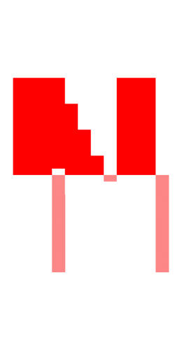

<div align="center">



A keyboard-first launcher for Windows. Press a global hotkey to summon a floating search bar and quickly find and launch applications, files, folders, and custom actions.

[](CHANGELOG.md)
[](#)
[](LICENSE)

</div>

## Overview

Nex is a lightweight, fast launcher that puts your workflow at your fingertips. Built in Rust for minimal memory footprint and near-instant responsiveness.

### Key Features

- **Global Hotkey** - Summon the launcher from anywhere with a customizable keyboard shortcut
- **Fuzzy Search** - Find apps, files, and folders with intelligent matching
- **Actions** - Execute custom commands, web searches, and system operations
- **Clipboard History** - Access recently copied items (optional)
- **Plugins** - Extend functionality with custom plugins
- **Game Mode** - Suppress the launcher while gaming

## Quick Start

### Run

```bash
cargo run --release
```

Or run the built binary directly:

```bash
./target/release/nex.exe
```

### Configuration

On first launch, Nex creates a default config at:
```
%APPDATA%\Nex\config.toml
```

Key settings:

| Setting | Default | Description |
|---------|---------|-------------|
| `hotkey` | `Alt+Space` | Global hotkey to summon launcher |
| `max_results` | `8` | Maximum results to display |
| `show_files` | `false` | Include files in search |
| `show_folders` | `false` | Include folders in search |
| `launch_at_startup` | `false` | Start with Windows |

### CLI Commands

```bash
nex --status          # Check if running
nex --quit            # Stop the launcher
nex --restart         # Restart the launcher
nex --status-json     # JSON status output
```

## Search Syntax

- **Type normally** - Fuzzy search across all indexed items
- **Prefix commands** - `>` for actions, `@` for apps, `:` for files/folders
- **Web search** - Prefix with `?` to search the web

## Project Structure

```
nex/
├── apps/core/          # Main Rust application
│   ├── src/
│   │   ├── runtime.rs  # Main entry point & event loop
│   │   ├── search.rs   # Search indexing & querying
│   │   ├── discovery.rs # File/app discovery
│   │   └── ...
│   └── Cargo.toml
├── apps/assets/        # Icons & branding
├── scripts/           # Build & packaging scripts
├── tests/             # Integration tests
└── docs/              # Documentation
```

## Requirements

- Windows 10/11 (64-bit)
- Rust 1.75+ (for building from source)

## Building

```bash
# Development build
cargo build

# Release build
cargo build --release

# Run tests
cargo test
```

## Documentation

- [Architecture Notes](docs/README.md)
- [Release Notes](CHANGELOG.md)

## License

MIT License - see [LICENSE](LICENSE) for details.
